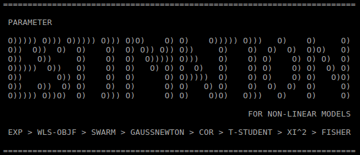

# Resumo

O problema de estimação de parâmetros de modelos não lineares é um problema recorrente na engenharia química.

A metodologia de estimação de parâmetros baseada no critério da máxima verossimilhança, descrita em Schwaab e Pinto [1],
permite obter valores de parâmetros com os quais um modelo faz a melhor descrição de um conjunto de dados experimentais,
julgar a qualidade desse modelo, tendo em vista a variância experimental associada às medidas,
e avaliar intervalos de confiança para os parâmetros determinados e para as previsões fornecidadas pelo modelo.

Aqui, apresentamos um código básico e material complementar no âmbito do curso de estimação de parâmetros em problemas de engenharia química.

O código, em fortran moderno, compreende o cômputo de função objetivo, otimização de parâmetros e análise estatística dos resultados, para um modelo algébrico diferencial arbitrário.
Esse código e material serão distribuídos eletronicamente, através da plataforma gitlab, no projeto ESTIMATION, vinculado ao perfil de um dos autores (iurisegtovich) [2].
O repositório servirá de base centralizadora de relatos de problemas (issues) e distribuidora de versões atualizadas (releases).

O material se propõe a ser o mais simples possível, dentro do escopo do curso de estimação de parâmetros em problemas de engenharia química.
Desse modo, permite o aluno investigar a estrutura do código, se poupando de implementar cada etapa tratada no curso individualmente, mas ao mesmo tempo não se limitando a posição de um usuário de software inauditável.

O código está organizado em uma série de pastas, e pode ser obtido, em sua estrutura original no repositório git através do endereço [3].

Instruções para instalar as ferramentas para compilação de código em fortran e construção de executáveis estão descritas para windows em [4] e para linux em [5].

Instruções para carregar o código ESTIMATION a partir do repositório git, usando as ferramentas recomendadas, e executar exemplos e acoplar o código de estimação a modelos algébrico diferenciais arbitrários estão descritas em [6].

Material de apoio teórico sobre a metodologia implementada no ESTIMATION está disponível em [7].

#Referências

* [1] Schwaab & Pinto, 2007, Análise de Dados Experimentais I - Fundamentos de Estatística e Estimação de Parâmetros.
[http://www.e-papers.com.br/produtos.asp?codigo_produto=2792]
* [2] https://gitlab.com/iurisegtovich/estimation/wikis/home
* [3] https://gitlab.com/iurisegtovich/estimation.git
* [4] https://drive.google.com/drive/folders/1XkYoQxE0n9-_LGhKgn1Qp3XsMpgUg7_y
* [5] https://drive.google.com/drive/folders/1ig_FLHNz24TN2ibzPxI9_cAjnWmpmO_E
* [6] https://drive.google.com/drive/folders/1Qyd68U0INcv54r0vWPdNPxjdYVopDDtE
* [7] https://drive.google.com/drive/folders/19ecI2YKMGeaCGc4s_e1WOkTFfQ_AZ1x8
