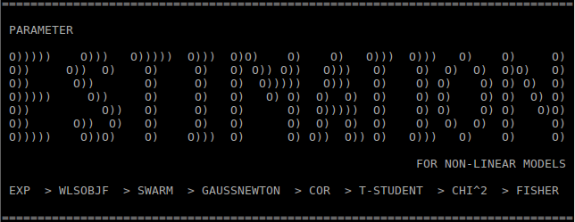

# Resumo

O problema de estimação de parâmetros de modelos não lineares é um problema recorrente na engenharia química.

A metodologia de estimação de parâmetros baseada no critério da máxima verossimilhança, descrita em Schwaab e Pinto [1],
permite obter valores de parâmetros com os quais um modelo faz a melhor descrição de um conjunto de dados experimentais,
julgar a qualidade desse modelo, tendo em vista a variância experimental associada às medidas,
e avaliar intervalos de confiança para os parâmetros determinados e para as previsões fornecidadas pelo modelo.

Aqui, apresentamos um código básico e material complementar no âmbito do curso de estimação de parâmetros em problemas de engenharia química.

O código, em fortran moderno, compreende o cômputo de função objetivo, otimização de parâmetros e análise estatística dos resultados, para um modelo algébrico diferencial arbitrário.
Esse código e material serão distribuídos eletronicamente, através da plataforma github, no projeto ESTIMATION, vinculado ao meu perfil (iurisegtovich) [9].
O repositório servirá de base centralizadora de relatos de problemas (issues) e distribuidora de versões atualizadas (releases).

O material se propõe a ser o mais simples possível, dentro do escopo do curso de estimação de parâmetros em problemas de engenharia química.
Desse modo, permite o aluno investigar a estrutura do código, se poupando de implementar cada etapa tratada no curso individualmente, mas ao mesmo tempo não se limitando a posição de um usuário de software inauditável.

O código está organizado em uma série de pastas, e pode ser obtido, em sua estrutura original no repositório git através do endereço [3].

Material de apoio teórico sobre a metodologia implementada no ESTIMATION está disponível em [7].

## Instalação

Instruções para instalar as ferramentas para compilação de código em fortran e construção de executáveis estão descritas para windows em [4] e para linux em [5].

Instruções para carregar o código ESTIMATION a partir do repositório git, usando as ferramentas recomendadas, e executar exemplos e acoplar o código de estimação a modelos algébrico diferenciais arbitrários estão descritas em [6].

## Mais informações

Mais informações serão disponibilizadas em formato wiki vinculado ao repositório do projeto [2].

## Problemas ?

Para relatar problemas ou acompanhar a discussão de problemas, visite a seção "issues" do projeto [8]

## Agradecimentos

Agradeço ao prof. José Carlos Pinto
com quem aprendi sobre estimação de parâmetros no ano de 2013,
e ao prof. Amaro G. Barreto Jr.
com quem continuei meus estudos nesta área durante meu período de pós graduação.

## Referências

* [1] Schwaab & Pinto, 2007, Análise de Dados Experimentais I - Fundamentos de Estatística e Estimação de Parâmetros.
[http://www.e-papers.com.br/produtos.asp?codigo_produto=2792]
* [2] https://github.com/iurisegtovich/estimation/wiki
* [3] https://github.com/iurisegtovich/estimation.git
* [4] https://drive.google.com/open?id=1DVgU6gAzuvOezrl_V1oZj_gfTe5oGeb-
* [5] https://drive.google.com/drive/folders/1ig_FLHNz24TN2ibzPxI9_cAjnWmpmO_E
* [6] https://drive.google.com/drive/folders/1Qyd68U0INcv54r0vWPdNPxjdYVopDDtE
* [7] https://drive.google.com/drive/folders/19ecI2YKMGeaCGc4s_e1WOkTFfQ_AZ1x8
* [8] https://github.com/iurisegtovich/estimation/issues
* [9] https://iurisegtovich.github.io/estimation/

## Como citar o recurso estimation em um trabalho científico:

* [1] Este repositório de código
Segtovich I. S. V. et al., parameter Estimation for non linear models, código computacional hospedado no github, DOI: 10.5281/zenodo.2653205 

> * trabalhos academicos e fontes utilizadas diretamente
> * [1] Livro de fundamentos da metodologia: Schwaab & Pinto, 2007, Análise de Dados Experimentais I - Fundamentos de Estatística e Estimação de Parâmetros.
> [http://www.e-papers.com.br/produtos.asp?codigo_produto=2792]
> * [1] Artigos originais anteriores ao livro:
> * [1] PSO - KENNEDY & EBERHART, PROC IEEE INTERNATIONAL CONFERENCE ON NEURAL NETWORKS, PERTH, AUSTRALIA, PP. 1942-1948
> * [1] Gauss Newton - ANDERSON ET AL.,AICHE J.,1978,24(1),20-29
> * [1] L&B - LAW & BAILEY,CHEM.ENG.SCI.,1963,18,189-202
> * [1] zigurat - Marsaglia, G. & Tsang, W.W. (2000) `The ziggurat method for generating
> ! random variables', J. Statist. Software, v5(8)
> * [1] zigurat src https://people.sc.fsu.edu/~jburkardt/f_src/ziggurat/ziggurat.html
> * [1] gsl - https://www.gnu.org/software/gsl/
> * [1] dassl/linpack src- http://www.netlib.org/ode/
> * [1] dassl A DESCRIPTION OF DASSL: A DIFFERENTIAL/ALGEBRAIC SYSTEM SOLVER, L. R. PETZOLD, SAND82-8637, SANDIA NATIONAL LABORATORIES, SEPTEMBER 1982
> * [1] msys2/mingw64 - https://www.msys2.org/ & https://github.com/mirror/mingw-w64
> * [1] manual estima93 (ESTIMA:“Um Pacote Computacional para Estimação de Parâmetros e Projeto de Experimentos”) -
> REFERENCIA E BUSCA BIBLIOGRAFICA DE LITERATURA CITANDO:
> https://scholar.google.com.br/scholar?q=author%3Anoronha+author%3Apinto+author%3Amonteiro+author%3Alob%C3%A3o+author%3Asantos

